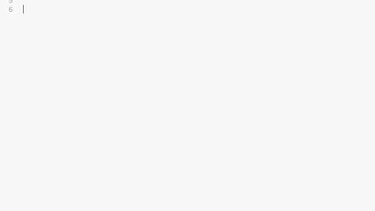

# Surround for Brackets

Simply select the text you wish to surround and press ```Ctrl - Shift - J``` or ``` Cmd - Shift - J``` for Macs.

#### Installation

Install Brackets at: http://download.brackets.io/

##### Step 1: Clone down the extension repo
```
git clone https://github.com/pedelman/brackets-surround.git
```
You can also click the download as zip button. Once downloaded, unzip the folder.

##### Step 2: In Brackets, click "Help"
Once selected, click the show extension folder.

##### Step 3: Copy over the folder into the "user" folder
Drag the cloned folder into this folder.

##### Step 4: Restart brackets
Restart Brackets to see the new plugin. To verify the extension was loaded, click "Edit" and you should see a option called "Surround".

### Surround is now installed and ready to go!

---

#### Easy to add new functionality

```js
cases = {
   '('    :   ')',
   '{'    :   '}',
   '<'    :   '>',
   '['    :   ']',
   '/*'   :  '*/',
   '<!--' : '-->',
   '<%'   :  '%>',
   '<%='  :  '%>'
};
```

Simply add a new key/value to the cases and it will instantly close the key.

#### Example


